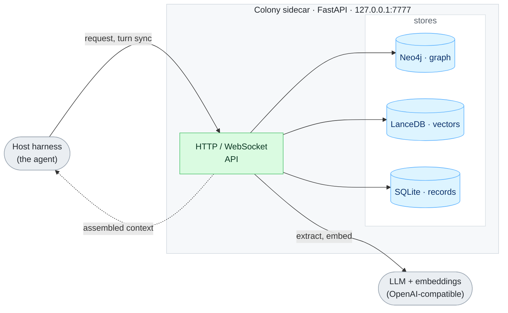

<div align="center">

# Colony

A local-first cognition sidecar for AI agents: persistent memory, relationships,
temporal awareness, earned autonomy, and self-improvement.

[](LICENSE)
[](https://pypi.org/project/colonyai/)
[](https://github.com/Aevonix/ColonyAI/actions/workflows/ci.yml)
[](https://github.com/Aevonix/ColonyAI/releases)
[](https://pypi.org/project/colonyai/)

</div>

## Overview

Colony is a sidecar process that gives any agent durable state and, when you
want it, carefully governed agency. It runs alongside the agent's host (a chat
gateway, a coding tool, or anything that can call an HTTP API), assembles
relevant context before each turn, learns from each turn afterward, and can
pursue goals between turns.

The agent stays stateless; Colony holds the state. Memories, facts,
commitments, relationships, beliefs, projects, skills, and time all persist
across sessions and outlive any single conversation. Everything runs locally
against your own stores and your own model endpoints.

Colony is not an agent and does not generate user-facing replies. It is the
layer underneath one.

## Quick start

Requirements: Python 3.11+, Neo4j 5.x reachable over Bolt, and an
OpenAI-compatible LLM and embedding endpoint.

```bash
pip install colonyai

# Interactive wizard: identity, state dir, Neo4j, API key, model endpoints,
# autonomy preset, and any detected agent harnesses
colony init

# Diagnose configuration and (if running) live runtime health
colony doctor

# Start the sidecar
colony start -d             # daemon; omit -d to run in the foreground
```

Verify it is up:

```bash
curl -s -H "Authorization: Bearer $COLONY_API_KEY" \
  http://127.0.0.1:7777/v1/host/health
```

To run the sidecar and Neo4j together under Docker, clone this repo and use
the provided `docker-compose.yml` (it builds the sidecar image from
`./sidecar`, so compose needs the repo checkout; the pip path above does not).

## The autonomy model

Agency in Colony is *earned, not configured*. Two mechanisms work together:

- **One knob:** `COLONY_AUTONOMY_PRESET` supplies coherent defaults for all
  fourteen autonomy flags at once. `passive` observes and remembers only;
  `calibration` (the wizard default) runs every subsystem in shadow or
  dry-run; `autonomous` runs them live. An explicitly set env var always wins
  over the preset, and the exploration sandbox never goes live from a preset.
- **The trust engine:** every action class carries a stage
  (`shadow` → `ask_first` → `act_first`) and a confidence score computed from
  its real, journaled track record. Clean calibration graduates a class to
  asking first; a proven record graduates it to acting first, and each
  graduation notifies the owner. Failures trip a circuit breaker back to
  `ask_first`, and an immutable floor (money movement, irreversible deletion,
  credential changes, bulk messaging) is never self-decidable at any
  confidence. Every gate decision lands in a unified action journal
  (`colony-action-journal.db`), and the daily proactive-delivery cap adapts to
  the delivery domain's own track record.

`GET /v1/host/autonomy/posture` returns the resolved posture of the running
process, so you always see what is actually in effect rather than what you
think you configured.

## Connecting an agent

| Path | For | How |
| --- | --- | --- |
| Hermes plugins | Chat/orchestrator agents on [Hermes](https://github.com/NousResearch/hermes-agent) | `colony init --agent-harness hermes` or `plugins/hermes-plugin/install.sh` |
| MCP | Claude Code, Codex, Crush, OpenCode (and Hermes too) | `colony mcp setup` |
| REST API | Anything else | `http://127.0.0.1:7777/v1/host/...` with a bearer key |

All paths read and write the same stores, so a fact learned in a chat is
visible from a coding tool and vice versa. See
[`docs/HARNESS_INTEGRATION.md`](docs/HARNESS_INTEGRATION.md) for the full
guide.

### Hermes plugins

| Plugin | Role |
| --- | --- |
| [`plugins/hermes-plugin`](plugins/hermes-plugin/) | General adapter: native Colony tools, slash commands, lifecycle hooks, event subscriber, autonomy bridge, host-side ops tooling |
| [`plugins/colony-memory`](plugins/colony-memory/) | Memory provider: injects assembled context before each turn and syncs the turn back for extraction |
| [`plugins/hermes-context`](plugins/hermes-context/) | Context engine: cognitive compression of the conversation window |
| [`plugins/feeds-manage`](plugins/feeds-manage/) | Conversational management of intelligence feeds ("keep me informed about X") |

## Subsystem tour

- **Memory and graph.** Semantic recall with recency weighting and
  deduplication, backed by Neo4j for entities/relationships and LanceDB for
  vectors, plus a structured world model populated from conversation.
- **Contacts and theory of mind.** A contact per person with channel handles,
  trust tier, relationship score, affect tracking, shared facts, and an
  evolving engagement profile.
- **Temporal awareness.** Authoritative current time, per-contact timezones,
  and a unified journal of every turn and action, so the agent knows when
  things happened and what is overdue.
- **Initiatives and executor.** A background loop generates proactive
  initiatives (follow-ups, research, check-ins, owed deliverables); an
  optional in-process executor (`COLONY_EXECUTOR_ENABLED`) reasons about them
  with the agent's own LLM and tools and closes the loop.
- **Projects.** Multi-step goal persistence (`COLONY_PROJECTS_MODE`): a
  planner decomposes a goal and the project engine pursues it across autonomy
  ticks instead of one-shot actions.
- **Skills memory.** Compounding procedure learning
  (`COLONY_SKILLS_DISTILL`): retry-successes and novel diagnoses are distilled
  into reusable procedures, retrieved into future prompts, and ranked by
  their real win/loss record.
- **Beliefs.** Contradiction detection, resolution, and stale-belief decay
  over what the agent holds true (`COLONY_BELIEFS_MODE`).
- **Connectors (senses).** Read-only pull connectors (IMAP email, calendar,
  filesystem documents, generic webhook) that feed observations into the same
  cognition path (`COLONY_CONNECTORS_MODE`, per-connector
  `COLONY_CONNECTOR_<NAME>_*` env).
- **Workers.** An installable worker daemon (`colony-worker`, with systemd and
  launchd templates under `sidecar/colony_sidecar/workers/deploy/`) executes
  queued jobs; a server-side governor re-verifies capabilities and audits
  every report, because workers are untrusted (`COLONY_WORKERS_MODE`).
- **Sandbox.** Gated Docker exploration sandbox for code execution: no
  network, no credentials, capped resources, `off | dry_run | live`
  (`COLONY_SANDBOX_MODE`; live is explicit-only, never set by a preset).
- **Feeds.** Spec-driven intelligence feeds (collect → distill → digest) via
  the `colony feeds` CLI. See [`docs/FEEDS.md`](docs/FEEDS.md).
- **Channels and persona.** Generic channel registration with auto-derived
  channel ids, plus a persona deployment layer (`colony persona`) and
  full-state backup/restore (`colony backup` / `colony restore`). See
  [`docs/CHANNEL_FRAMEWORK.md`](docs/CHANNEL_FRAMEWORK.md).
- **Mining.** An escalation miner spots turns where the agent had to be
  corrected or consulted (`COLONY_ESCALATION_MINING`), and a training-corpus
  exporter (`POST /v1/host/mining/corpus/export`) writes fine-tune JSONL
  under the state dir only; nothing ever leaves the machine.
- **Self-improvement.** Bounded, journaled runtime parameters that the
  meta-learning loop adjusts and consumers actually read back
  (`GET /v1/host/self/params`), plus stated-vs-realized confidence
  calibration feeding trust. All LLM roles share one versioned prompt charter
  (`cognition/charter.py`); the prompt version is journaled with every action.

## Architecture



| Component | Role |
| --- | --- |
| Sidecar (`colony_sidecar`) | FastAPI service; the only thing the host talks to |
| Graph store (Neo4j) | Entities, people, memories, world model, and their relationships |
| Vector store (LanceDB) | Embeddings for semantic recall |
| Record stores (SQLite) | Contacts, commitments, goals, affect, facts, initiatives, action journal, adaptive params |
| Embeddings | Any OpenAI-compatible embedding endpoint (configurable) |
| LLM | Any OpenAI-compatible chat endpoint, used for extraction, reasoning, and the executor |

The host's LLM and embedding endpoints are pushed to the sidecar at runtime
via `POST /v1/host/configure` and persisted, so the sidecar uses the same
models as the agent.

## Configuration

Configuration is read from the state directory (default `~/.colony`) and
environment variables. [`.env.example`](.env.example) is the commented
reference for every supported variable. The essentials:

| Variable | Purpose |
| --- | --- |
| `COLONY_STATE_DIR` | Where stores and config live (default `~/.colony`) |
| `COLONY_API_KEY` | Bearer token required by the sidecar API |
| `NEO4J_URI` / `NEO4J_USER` / `NEO4J_PASSWORD` | Graph store connection |
| `COLONY_OWNER_CONTACT_ID` | The owner's contact, used by the approval gate and owner-preference learning |
| `COLONY_AUTONOMY_PRESET` | `passive` / `calibration` / `autonomous`; defaults for the whole autonomy posture |
| `COLONY_APPROVAL_POLICY` | `strict` (default) or `graduated` |
| `COLONY_SEARCH_PROVIDER` | Web search provider for research (`tavily`, `brave`, `serpapi`); unset uses the keyless DuckDuckGo fallback |

## Operations

```bash
colony doctor        # 30 checks: config, stores, and the RUNNING server's
                     # autonomy posture, trust engine, executor, projects,
                     # beliefs, workers, sandbox, connectors, mining
colony status        # health and pipeline state
colony validate      # end-to-end pipeline validation; live-fires the
                     # sidecar's own LLM router (uses LLM credits)
```

The Hermes integration adds a host-side doctor
(`plugins/hermes-plugin/ops/`) that validates the plugins, configuration, and
scheduled jobs. All doctors exit non-zero on failure and are suitable for
scheduling.

## Development

```bash
git clone https://github.com/Aevonix/ColonyAI.git
cd ColonyAI/sidecar
pip install -e ".[dev]"
python -m pytest tests/ colony_sidecar/ -q
```

The Python sidecar lives under `sidecar/`; the host integration plugins under
`plugins/`. See [CONTRIBUTING.md](CONTRIBUTING.md).

## License

MIT. See [LICENSE](LICENSE).
